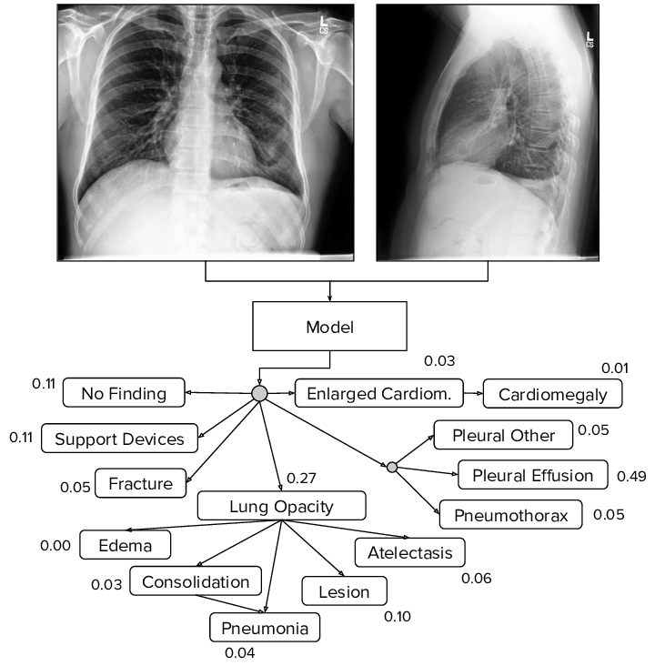

# Chest X-Ray classification (CS156b)
This repository contains PyTorch implementations of several different classifiers for chest X-ray images, based on the multi-class and multi-label CheXpert dataset.

## Overview

This project implements a deep learning model to classify 9 of the original 14 observations in chest radiographs. The model is trained on the CheXpert dataset, a large public dataset for chest radiograph interpretation.

Key features:
- Custom dataset loader for CheXpert
- Training pipeline with support for various model architectures, data augmentation, fine-tuning, and regularization techniques
- Evaluation metrics tailored for multilabel classification
- Inference script for making predictions on new images
